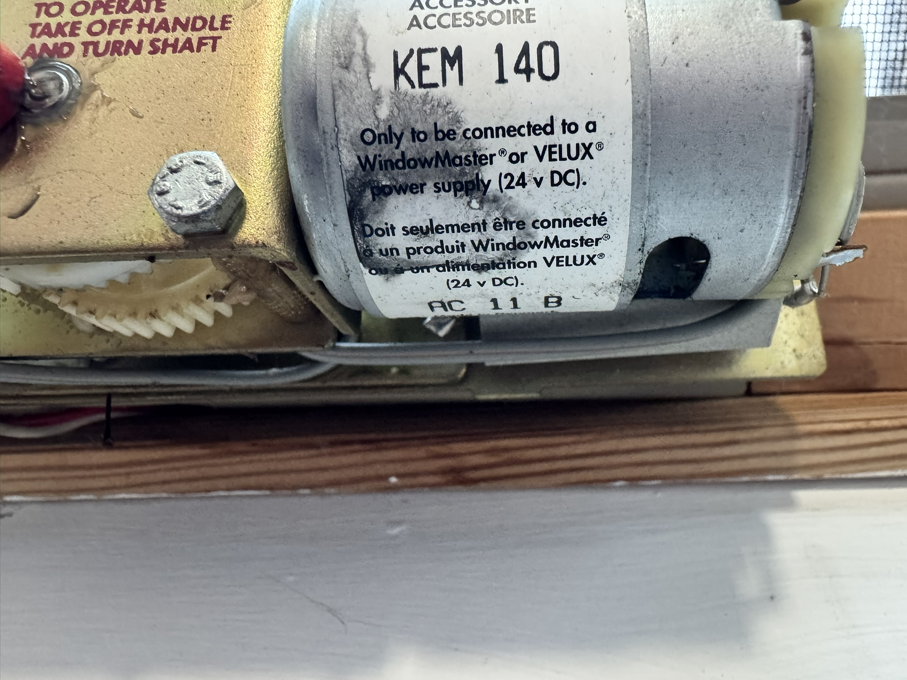
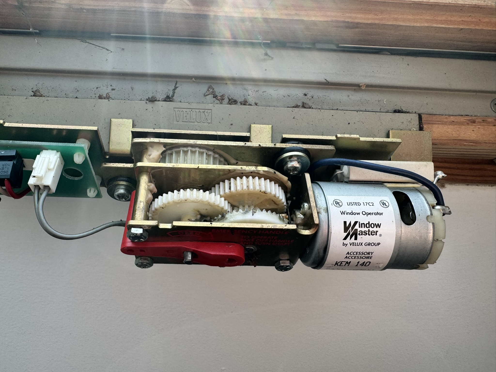
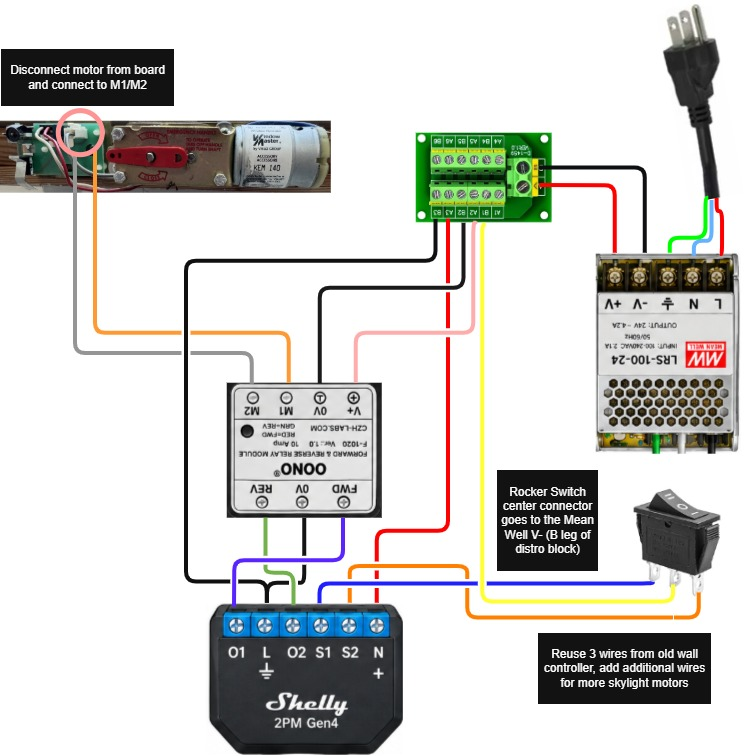
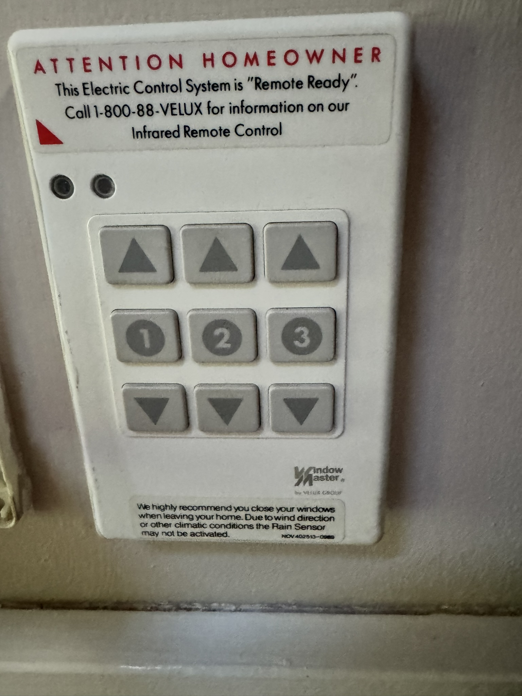
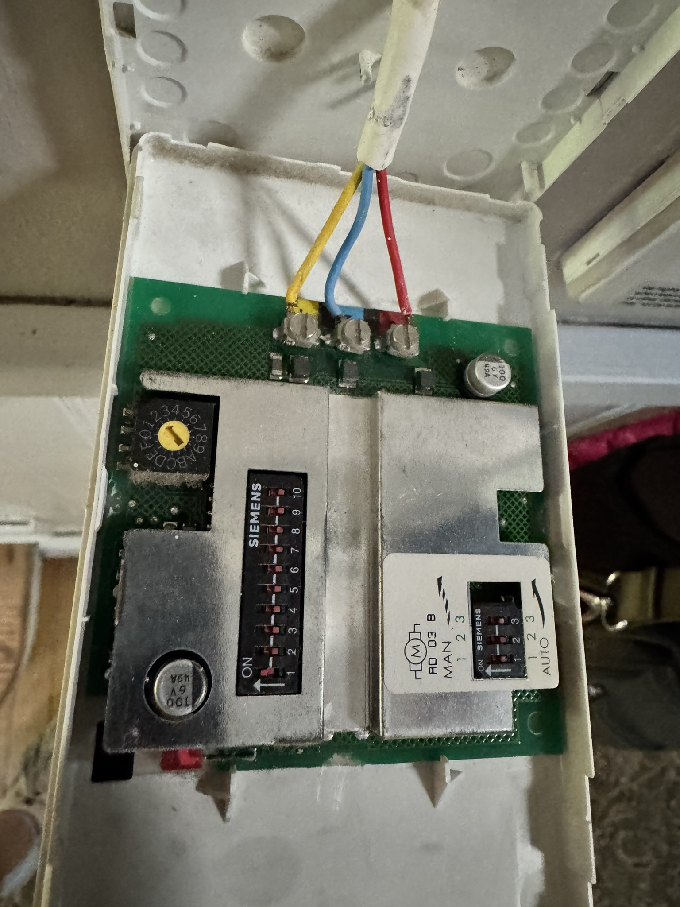
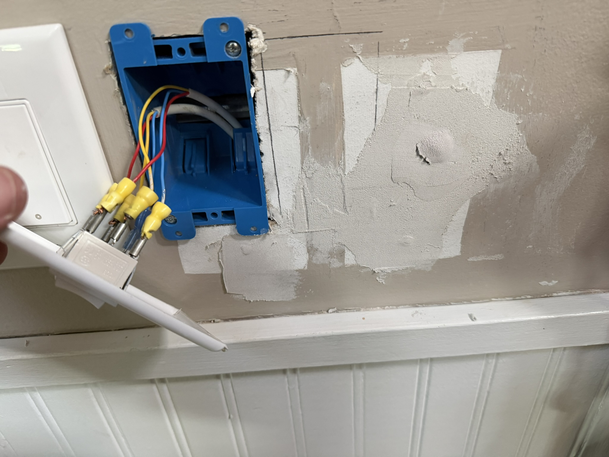
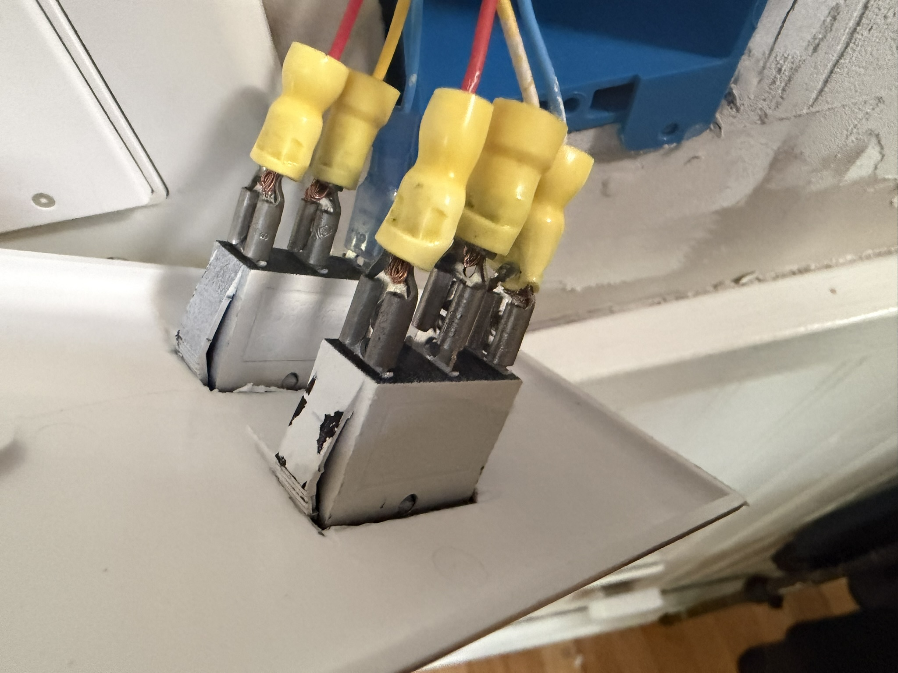
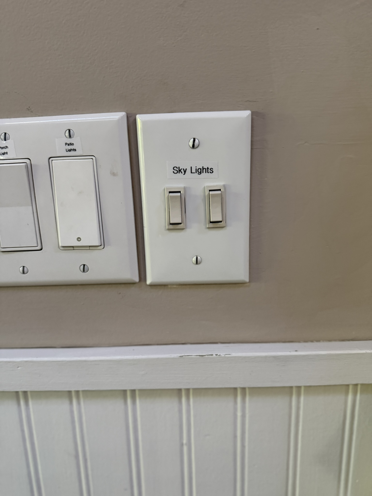
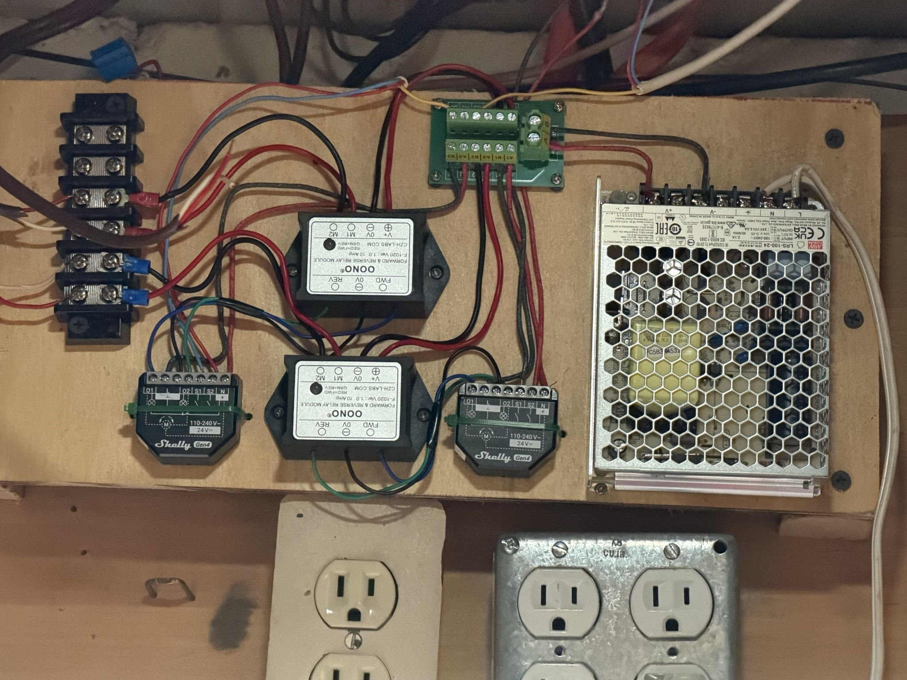
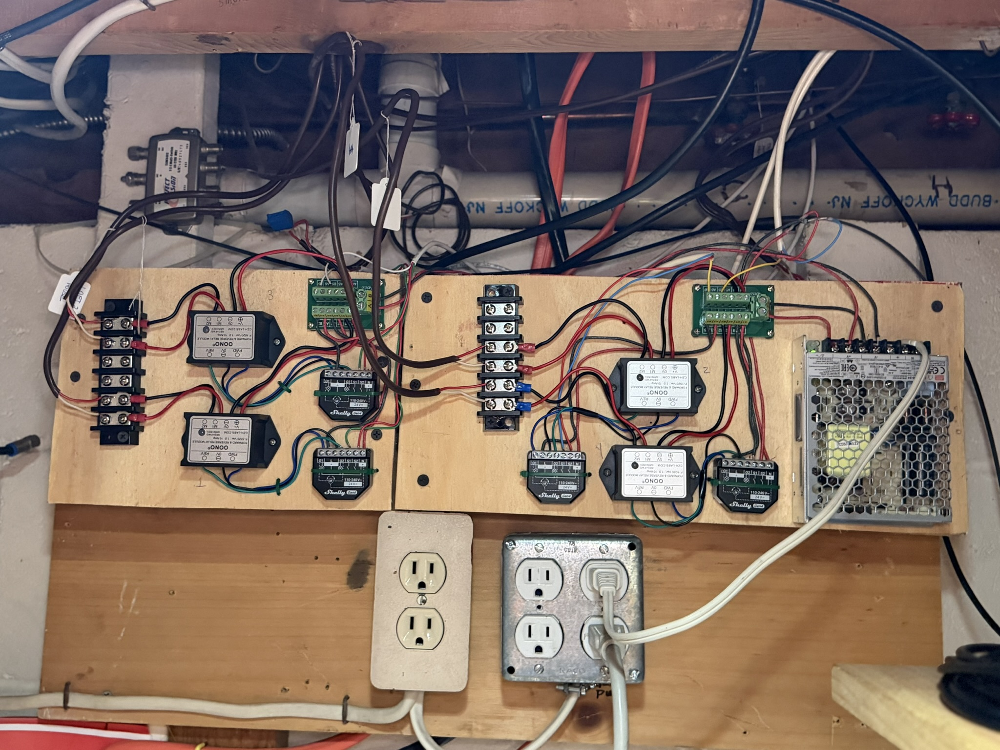

# Build Guide: Wiring and Assembly

## ⚠️ Before you start

- **Turn off power** at the breaker (or unplug the supply) before opening any
  enclosure or connecting/disconnecting wires.
- **Verify with a multimeter** that circuits are de-energized before touching
  bare conductors. Don't trust a breaker label alone.
- Work one window at a time so you always have a known-good reference if
  something doesn't behave as expected.
- This is hobbyist documentation, not professional electrical advice — see
  the disclaimer on the [home page](../index.md) before proceeding.

  ### Suggestion - Photograph Existing Setup
  A lesson learned is to photograph everything before dismantling the old WLC-100 
  and disconnecting wires.  Using small paper labels with string to number the wires, they were tracked in a scratch ledger that was referred back to when
  wiring the new setup.  

  The rain sensor wires will not be used in this setup.  A rain sensor solution exists with a Shelly Flood device that will be later incorporated in this guidance if successful.  
  

## A note on pacing this project

The author didn't wire all four windows at once. The first pass covered two
windows and stopped at wall buttons only — Shelly app/cloud connectivity was
fighting registration issues at the time, and getting reliable manual control
working was the priority. Only once that first pair was solid did the
remaining two windows, the app/automation side, and the wall-switch
cutouts get tackled. If the reader is doing this across multiple windows,
consider getting one window fully working end-to-end before duplicating the
work — it's much easier to debug one variable at a time.

## Step 1: Remove the old controller

1. With power off, disconnect and remove the WLC 100 controller. Label each
   wire as you disconnect it (motor leads, keypad bus wires, rain sensor if
   present) — you'll likely reuse the keypad bus wiring later.
2. If you're unsure which wires are which, use continuity testing rather
   than trusting wire color — see [Troubleshooting](troubleshooting.md) for
   why installer wire colors don't always match the WLC 100's molded label
   diagram.

## Step 2: Identify and prep the motor leads

1. At each KEM 140 motor, open the housing (remove the motor cover) and locate the **motor
   terminals** directly on the motor windings — not the incoming harness
   wires, which used to route through the motor's internal PCB.

   

   
2. Confirm you have the right two leads with a continuity/resistance check
   (power off).  In this setup these are the two grey wires running to the motor.  
3. Reuse existing wire runs (when the gauge and condition
   are adequate - they should be from prior install) from these motor terminals back to where you'll mount the
   OONO F-1020 for that window.

## Step 3: Mount the power supply and distribution block

1. Mount the Mean Well LRS-100-24 in a ventilated location, ideally near
   where the old WLC 100 was installed, since existing wiring already runs
   from there to each window.
2. Wire mains power into the Mean Well's AC input per its datasheet (this is
   the one line-voltage connection in this build — treat it with the same
   care as any mains wiring).
3. Mount the terminal block distribution module near the Mean Well supply
   and wire its input from the Mean Well's DC output (+V/−V). This gives you
   a set of screw terminals to run separate +V/−V home runs out to each
   window's Shelly and OONO pair, instead of stacking multiple wires under
   the Mean Well's own output terminals.
4. Leave the downstream home runs disconnected from OONO or terminal block if using one until you've completed wiring for at least one window
   and are ready to test.

## Step 4: Wire one window's Shelly + OONO + motor

Repeat this step for each window. Refer to the full wiring table in
[Architecture](architecture.md#full-wiring-table-per-window) as you go.

1. Mount the Shelly 2PM Gen4 and OONO F-1020 in an enclosure near the
   window's junction point.
2. Wire the Mean Well DC output to the Shelly's power input, **observing the
   reversed DC polarity convention**:
   - Mean Well −V → Shelly L
   - Mean Well +V → Shelly N
3. Wire the Shelly's outputs to the OONO's trigger inputs:
   - Shelly O1 → OONO FWD
   - Shelly O2 → OONO REV
4. Power the OONO module itself from the same Mean Well supply:
   - Mean Well +V → OONO V+
   - Mean Well −V → OONO 0V (both the top and bottom 0V terminals)
5. Wire the OONO's motor outputs to the motor leads you prepped in Step 2:
   - OONO M1 → KEM 140 motor wire 1
   - OONO M2 → KEM 140 motor wire 2
6. *(Optional)* If you want spike protection for relay longevity, install an
   RC snubber (0.1µF/100Ω/1/2W/600VAC) across the OONO's M1/M2 terminals,
   spliced in at the terminal block before the run out to the motor. The
   reference build skipped this for simplicity — it's not required for the
   system to work, and can be added later per window without touching the
   rest of the wiring.
7. Wire the momentary pushbuttons for manual control (see Step 5 below).

At this point you can reference the Wiring Summary Table in the Appendix to confirm your connections.

## Step 5: Wire wall buttons using the reused keypad wiring

The original WLC wall-keypad bus is typically a 3-wire run (often
yellow/blue/red in older installs) carrying a WindowMaster-specific digital
protocol. Once the WLC 100 is out of the picture, these are simply three
copper conductors you can repurpose as plain momentary-switch wiring:

1. Identify the 3-wire run at both the wall keypad location and the
   controller end.
2. Use one wire as a shared **common return**, wired to Mean Well −V. (the author's install selected yellow)
3. Use the second wire as the **open** signal, wired through your open
   pushbutton to Shelly S1.
4. Use the third wire as the **close** signal, wired through your close
   pushbutton to Shelly S2.
5. At the wall, replace the old WindowMaster keypad with simple momentary
   pushbuttons (doorbell-style or momentary rocker switch), wired to the open/close/common conductors.

In the author's install, the original WLI 130 keypad locations were reused
for the new rocker switches by installing single-gang remodel boxes and
cutting rectangular openings into blank switch-plate covers (roughing out the
opening from the back with a rotary tool, then finishing the edges from the
front with a utility knife). The old keypad cutout in the wall was patched,
spackled, and painted once the new switch was in and tested. This is
cosmetic finishing, not required for the system to function — a reader happy
with a surface-mount switch or a different cover plate can skip this step
entirely.

## Step 6: First power-up and test

1. Double-check every connection against the wiring table before restoring
   power — this is much easier to fix now than after the enclosure is closed
   up.
2. Restore power to the Mean Well supply.
3. Confirm the Shelly powers on (check its status LED / app connectivity).
4. Briefly test the open and close wall buttons, watching the motor for
   correct, smooth movement in each direction.
5. If a motor moves the wrong direction, swap the OONO's M1/M2 leads, either at the
   motor or where the OONO M1/M2 connects to the motor leads (this is made easier by using a simple terminal block to make the connections).

On one of the author's windows, swapping the physical leads wasn't the fix
that ended up being used — the open button was driving the window closed and
vice versa, and it was simpler to leave the wiring alone and enable
**Reverse Directions** in the Shelly app instead (see
[Shelly Configuration, Step 2](shelly-configuration.md#step-2-switch-the-device-profile-to-cover)).
Either fix works; the reader doesn't need to do both.

## Step 7: Configure the Shelly as a Cover device

With hardware verified working via manual button presses, head to
[Shelly Configuration](shelly-configuration.md) to set up Cover mode,
assign inputs/outputs, and set travel time limits so the app and
automations work correctly. Note that Shelly's own calibration routine
cannot succeed on this build's wiring topology — see
[Shelly Configuration, Step 4](shelly-configuration.md#step-4-set-travel-time-calibration-will-not-succeed-on-this-build)
for why, and how travel time is set manually instead.

## Step 8: Close up and repeat

Once a window's Cover component has its travel time set and is tested from
the app, button, and any automations you plan to use, secure the enclosure
and move to the next window, repeating Steps 2–7.

| From | To |
|---|---|
| Mean Well +V | Distribution block + rail |
| Mean Well -V | Distribution block - rail |
| Distribution block + rail | Shelly N (+) |
| Distribution block - rail | Shelly L (⊥) |
| Distribution block + rail | OONO V+ |
| Distribution block - rail | OONO 0V (top, control ground) |
| Distribution block - rail | OONO 0V (bottom, power ground) |
| Shelly O1 | OONO FWD |
| Shelly O2 | OONO REV |
| Shelly S1 | Rocker switch (Open side) |
| Shelly S2 | Rocker switch (Close side) |
| Rocker switch (center/common) | Distribution block - rail (Mean Well -V) |
| OONO M1 | KEM 140 motor lead 1 (direct to motor, bypassing internal PCB) |
| OONO M2 | KEM 140 motor lead 2 (direct to motor, bypassing internal PCB) |
| RC Snubber | Across OONO M1 and M2 at motor terminals |

> **Note on Shelly DC wiring polarity:** The Shelly 2PM Gen4's L terminal is
> marked with a ground/negative symbol (⊥) and the N terminal with a positive
> symbol (+) for DC operation — this is reversed from typical AC wiring
> convention. Always verify against the physical label printed on your own
> unit before connecting power.

### Author's Completed Control Panel (2 Windows)

This shows the author's base configuration for 2 windows.  

### Author's 4-Window Control Board

