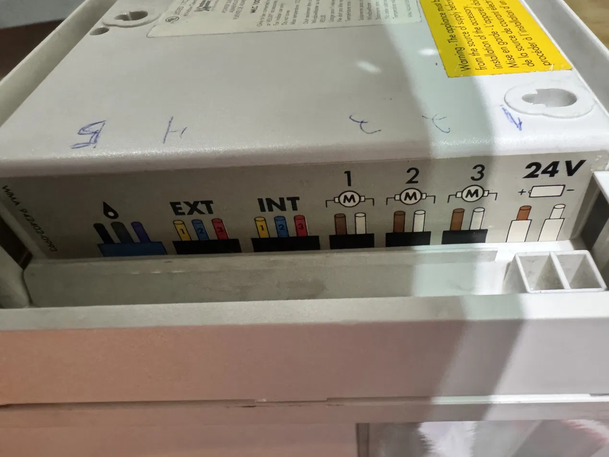
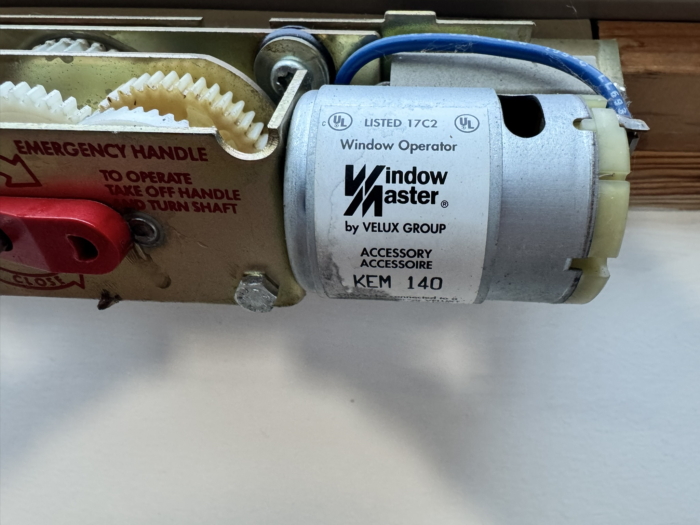
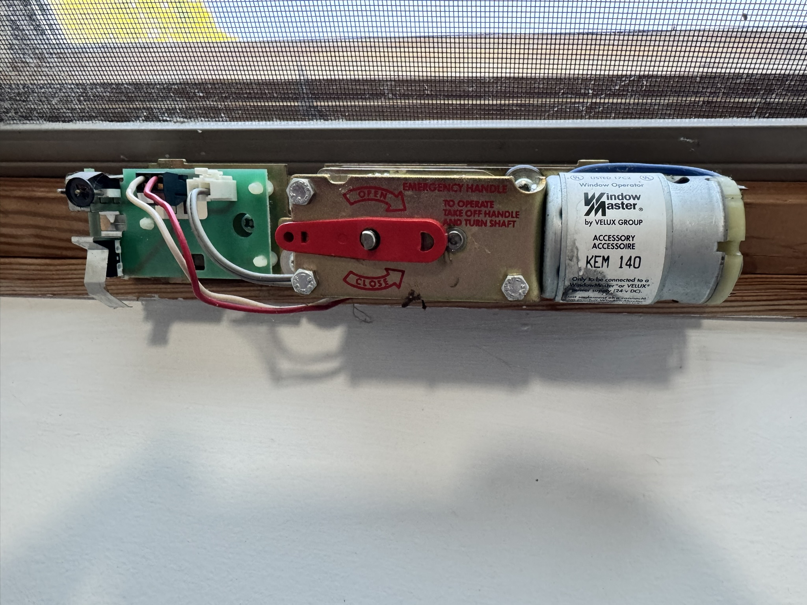

# Diagnosis: Is This Actually Your Problem?

Before you buy anything, spend 15 minutes confirming your hardware and
narrowing down whether the fault is in the controller's power supply, the
motor's internal PCB, or something else entirely. This project specifically
addresses failures in the WindowMaster **WLC 100** controller paired with
**KEM 140** motors — if your hardware is different, the general diagnostic
approach still applies, but part numbers and wiring will differ.

## Step 1: Confirm you have a WLC 100 controller

Look at the label on the controller unit itself (usually mounted in an attic,
closet, or utility space near the skylights). You're looking for:

- Text reading **"Only to be connected to WindowMaster or VELUX accessories"**
- A rated input of **21–24V DC**
- A wiring diagram molded into the plastic case showing terminals labeled
  `6` (rain sensor), `EXT` (external keypad bus), `INT` (internal keypad bus,
  usually unused), `M1`/`M2`/`M3` (motor connectors), and `24V` (power input)

If your label matches, you have the same controller this guide addresses.

## Step 2: Confirm your motors are KEM 140

Check the motor housing (visible at the skylight, usually along one edge of
the sash) for:

- **UL Listed 17C2** rating printed on the motor label
- A **rack-and-pinion** drive mechanism (a toothed bar that extends/retracts
  to push the window open)
- A simple **two-wire connection** running back to the controller (no data
  bus, just two conductors)

## Step 3: Test the power supply

The WLC 100's internal power supply board is a common failure point. To test
it in isolation:

1. Disconnect power to the WLC 100 at the breaker or unplug it.
2. Identify the `24V` input terminals on the WLC 100.
3. Temporarily wire in a bench supply or a **Mean Well LRS-100-24** (24V DC,
   4.5A) in place of the WLC 100's internal supply, feeding the same
   downstream terminals.
4. Restore power and test the wall keypad.

If the skylight now responds, your WLC 100's power supply board has failed —
which is expected, since these boards are known to burn out with age. This
confirms the direction of this retrofit (replace the controller and PSU
entirely) rather than a full motor replacement.

In the author's case, this test was done the hard way: applying bench power
directly to a dead WLC 100 was enough to get the WLI 130 keypad to drive the
window **open**, which confirmed the motor and keypad logic were both fine —
but there was no way to command it closed again without the rest of the
controller circuit, so a 16-foot ladder and the manual hand crank were still
needed to close it afterward. If the reader has the option to fully bypass
the old controller for this test (rather than power it through the original
board), it's a cleaner way to confirm the same thing without an extra ladder
trip.

## Step 4: Test the motor independently of its internal PCB

The KEM 140 motor has its own internal PCB with limit switches. This board
can fail independently and will block all current to the motor, **even with
a known-good power supply**. Don't skip this test — it's the difference
between "replace the controller" and "replace the motor."

1. With power off, open the motor housing and locate the **motor terminals**
   themselves (the two leads going directly to the motor windings) — not the
   incoming harness wires from the controller, which pass through the
   internal PCB first.
2. With power off, connect a multimeter set to continuity/resistance mode
   across the motor terminals to confirm you've found the right leads (a DC
   motor will typically show low resistance across its winding).
3. Briefly apply 24V DC directly to those motor terminals (not the harness
   wires) using your bench supply or Mean Well unit.
4. Observe whether the rack-and-pinion mechanism moves.

**If the motor moves:** the motor itself is healthy, and the internal PCB
(with its limit switches) is the failed component. This is the scenario this
guide is built for — bypass the dead controller *and* the dead motor PCB, and
drive the motor directly.

**If the motor does not move:** the motor itself has failed and this retrofit
won't help — you'll need to replace the motor unit.

## What you should know before moving on

By the end of diagnosis, you should be able to answer:

- Is the WLC 100's power supply the failure, the motor PCB, or both?
- How many windows/motors need to be retrofitted?
- Are your existing wall keypad wires (the WLL bus) intact and reachable, in
  case you want to reuse them for new physical buttons?

With that confirmed, head to the [Parts List](parts-list.md) to see what
you'll need to buy.
