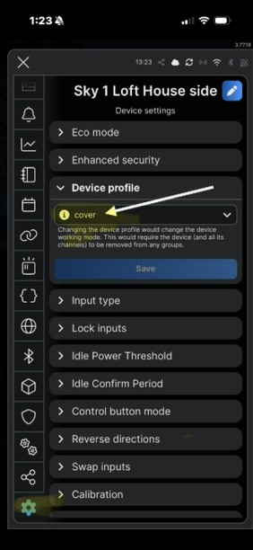

# Shelly App/Web Setup Walkthrough

Once a window is wired and you've confirmed the motor moves correctly in
both directions via the wall buttons (see [Build Guide](build-guide.md)),
configure the Shelly 2PM Gen4 as a **Cover** device so the app, wall
buttons, and any automations all work together correctly.

## Step 1: Add the device to the Shelly app

1. Power on the Shelly and follow the standard Shelly app pairing flow to
   add it to your WiFi network (or Zigbee/Matter hub, depending on your
   ecosystem).
2. Give it a clear name per window (e.g. "Skylight - Living Room") so you
   don't mix up channels later.

## Step 2: Switch the device profile to Cover

Cover mode is set from the Shelly device's own settings:

1. Open the device in the Shelly app and go to **Device Settings** by clicking the Shelly device.
2. Select the **Gear Configuration** blade from the left-hand navigation selector.
3. Under **Device Profile**, switch it from **Switch** to **Cover**.

While you're in this settings area, also set:

- **Input Type**: **Switch** The author's setup uses momentary rocker switches wired to S1/S2.  If using doorbell-type buttons (2 per window) you may need to use type "Button" setting.  
- **Movement Time Limits**: start conservatively at **15s** and re-verify
  after calibration (Step 4). Across the reference build's windows, actual
  calibrated times land around **16, 16.5, and 16.9 seconds**, so 15s is a
  safe starting ceiling that won't clip a real travel cycle once
  calibrated.
- **Reverse Directions**: because the motor leads landing on the OONO M1/M2
  terminals may not have a known polarity/orientation, enable **Reverse Directions** if open/close come out reversed — this avoids
  having to physically re-wire the motor leads to fix the direction.

## Step 3: Calibrate travel time

The Shelly's Cover mode uses a calibration routine to learn how long a full
open-to-close cycle takes, which it then uses to estimate position (0–100%)
between fully open and fully closed.

1. In the Cover component's settings, run the calibration/limit-setting
   routine (naming varies slightly by firmware version, look for
   "Calibrate" or "Set limits").
2. Let the motor run a full open and full close cycle uninterrupted during
   calibration.
3. Expect a measured travel time in the neighborhood of **16–17 seconds**
   (the reference build's windows calibrated to 16s, 16.5s, and 16.9s),
   though this will vary slightly window to window depending on sash size
   and mechanical friction. Consistency between open and close times for the
   same window is a good sign of healthy mechanics.
4. Revisit the **Movement Time Limits** value from Step 2 once you know the
   real calibrated time for this window, so the limit isn't cutting travel
   short.

Before using the Shelly's own calibration routine, the author's first pass at
setting these times was manual: a second phone's stopwatch was started when
the open command was sent from the app and stopped when the window reached
full travel, with the same value entered as the time limit for both
directions (padding the close time slightly "just to make sure"). That
approach is enough to get a window moving reliably, but it's still worth
running the formal calibration in this step afterward — it's what allows the
Shelly to report an accurate open/closed percentage rather than just an
on/off state, which matters once automations (like closing on rain) depend
on knowing how far open a window actually is.

## Step 4: Understand how end-of-travel is detected

Because this retrofit bypasses the KEM 140's internal PCB (which used to
house the physical limit switches), the Shelly has no direct signal telling
it "fully open" or "fully closed." It relies on the **calibrated travel
time** from Step 3 to know when to stop driving the motor.

The Shelly 2PM Gen4 documentation describes built-in current-spike /
obstacle detection that should sense the motor stalling against its
mechanical end-stop and cut power. **In practice, on this build, that
detection has not been observed to trigger.** Instead, at end of travel the
motor keeps running against the mechanical stop until the calibrated time
elapses:

- Gear strain audibly builds (a whining sound) as the motor continues
  driving against the stop.
- The window mechanism clunks, as if the stop is being run over/rolled
  past.
- Strain releases briefly, then builds again as the motor keeps pushing.

This is harder on the gears and stop hardware than the current-spike
detection is supposed to allow, and it's a known limitation of the current
build — see [Limitations](limitations.md) for details and the planned fix
(external roller-lever micro limit switches).

## Step 5: Test from the app and wall buttons together

1. Open and close the skylight from the app; confirm smooth full-travel
   movement and that the app's position indicator ends up at 0%/100% as
   expected.
2. Test the physical wall buttons again now that Cover mode is configured,
   confirming they still behave correctly.
3. If you're integrating with a smart home platform (Matter, Zigbee, etc.),
   verify the Cover exposes as an expected shade/cover entity and that
   open/close/stop commands all behave as expected.

Once one window is fully configured and tested, repeat for the remaining
windows. When everything's running, review
[Troubleshooting](troubleshooting.md) and [Limitations](limitations.md) for
known pitfalls and what's still on the roadmap.
