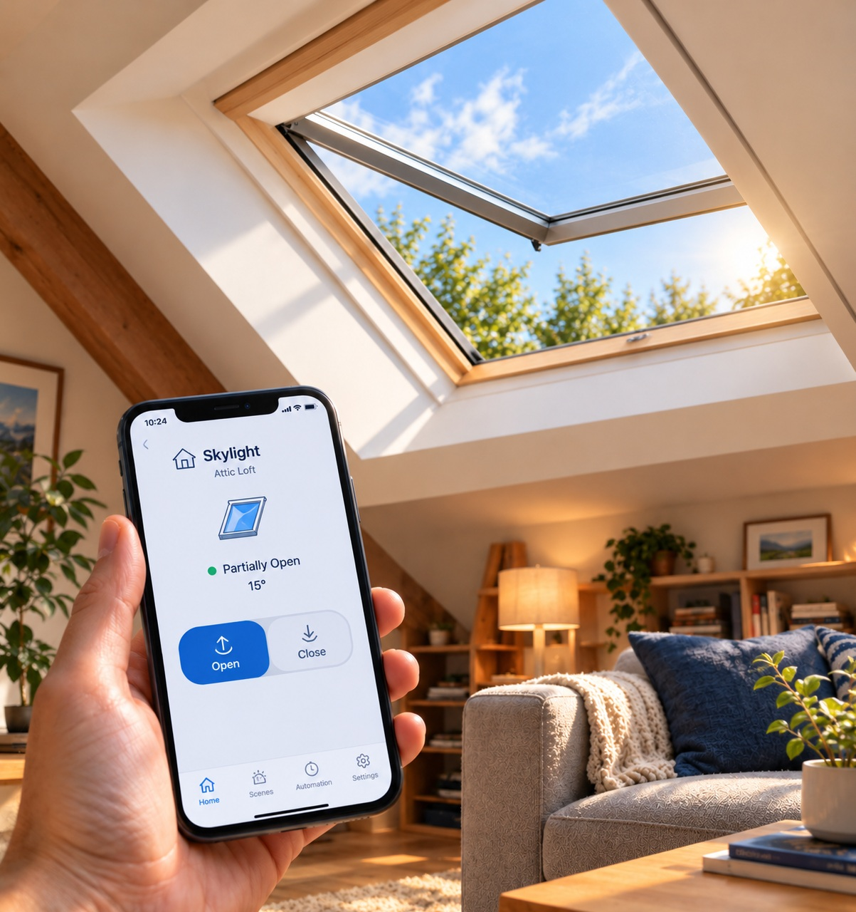

# A Self-Documented Solution: Reviving a Dead Skylight Controller (WLC 100 → Shelly Retrofit)

This site is one author's personal, documented account of how they diagnosed
and worked around a dead **WLC 100** skylight controller on their own
Velux/WindowMaster skylights. It's shared publicly as an open-source
reference in case it's useful to someone facing a similar problem — **it is
not a professional guide, a recommended standard, or the only way to solve
this**, and following any part of it, stated or implied, is entirely at the
reader's own risk. See the full [disclaimer](#disclaimer) below.

What this documented approach covers:

- Replacing the discontinued WLC 100 controller and its failure-prone power
  supply board
- Reusing the existing KEM 140 rack-and-pinion motors, without replacing the
  motors or re-running ceiling wiring
- Reusing existing wall keypad wiring as plain signal wires for new
  momentary pushbuttons
- Adding WiFi/Zigbee/Matter smart-home control via a Shelly 2PM Gen4

## Why this exists

WindowMaster WLC 100 controllers are no longer manufactured, and replacement
units are hard to find. The internal power supply board is a common failure
point, and the KEM 140 motors themselves have an internal PCB (with limit
switches) that can fail independently. When either part dies, the entire
skylight becomes inoperable — even though the motor itself is often still
perfectly healthy.

Rather than replacing the motors and rack-and-pinion hardware, the author
chose to bypass the dead controller and motor PCB and drive the motor
directly with off-the-shelf components. This site documents that specific
approach as-built, for reference only — readers facing similar hardware
failures may find other approaches that fit their situation, skills, tools,
or local code requirements better.

## The author's journey

The author's four skylights worked fine for about a decade before one pair
quietly stopped responding to its wall keypad. At the time, unrelated wall
work nearby made a damaged wire seem like the obvious culprit, and the
non-opening windows were shelved as a problem for another day — hand-cranking
a skylight 16 feet up a cathedral ceiling isn't exactly a weekend chore.

A few years later, with more time at home and more reason to want working
skylights again, the author went looking for answers and found what a lot of
WLC 100 owners eventually find: the controller is discontinued, its power
supply board is a known failure point, and there wasn't a clear off-the-shelf
replacement. That search stalled for a while, until modern AI coding
assistants made it practical to work through diagnosis, parts selection, and
wiring step by step, rather than needing to already be a WindowMaster
specialist.

This site is the result of that process, published as an open-source
reference for anyone else running into the same discontinued-controller
dead end — not as a claim that this is the correct or best fix for every
installation.

## How this documented solution is organized

The pages below walk through what the author did, in the order it was done:

1. **[Diagnosis](docs/diagnosis.md)** — How the author narrowed down the
   failure before buying parts.
2. **[Parts List](docs/parts-list.md)** — What was bought, and why.
3. **[Architecture](docs/architecture.md)** — How signal and power flow from
   button/app to motor in this design.
4. **[Build Guide](docs/build-guide.md)** — The wiring and assembly steps
   the author followed.
5. **[Shelly Configuration](docs/shelly-configuration.md)** — The app/web
   setup the author used, including a confusing UI step that tripped them up.
6. **[Troubleshooting](docs/troubleshooting.md)** — Pitfalls the author ran
   into, documented so others can recognize them faster.
7. **[Limitations](docs/limitations.md)** — What this particular approach
   doesn't do (yet), and what the author may change in the future.

Each of these pages carries the same reference-only framing as this one —
they describe what worked (and didn't) for one specific installation, not a
verified or endorsed procedure.

## ⚠️ Disclaimer
{: #disclaimer}

This site documents **one individual's personal, as-built approach** to a
problem they had with their own equipment. It is published in the spirit of
open-source knowledge sharing, in case it helps someone else — it is **not**:

- Professional electrical, engineering, or safety advice
- A recommended, endorsed, or verified procedure
- The only, best, or safest way to solve this problem
- A guarantee that the same steps will work, or work safely, for any other
  installation, hardware revision, jurisdiction, or set of skills

**No warranty.** This content is provided "as is," without warranty of any
kind, express or implied, including but not limited to accuracy,
completeness, safety, or fitness for any particular purpose.

**Assumption of risk.** Anyone who chooses to reference, follow, adapt, or
act on anything described here — stated or implied — does so entirely at
their own risk. This project involves mains-powered electrical supplies and
DC motor wiring at height; before touching any wiring:

- **Turn off power** at the breaker or unplug the supply before opening any
  enclosure or making/breaking connections.
- **Verify circuits are de-energized with a multimeter** before touching bare
  conductors — never assume a switch or breaker label is correct.
- If you are not comfortable working with electrical wiring, hire a licensed
  electrician. Skylights are often on dedicated circuits at height, adding
  fall-hazard risk on top of electrical risk.
- Follow your local electrical code and consult licensed professionals as
  needed. This project is documented as-built for one installation and may
  not be appropriate, safe, or legal for any other.

**Limitation of liability.** To the fullest extent permitted by law, the
author(s) of this site disclaim all liability for any damage, injury, loss,
or code violation arising from the use of, reliance on, or inability to use
this content, even if advised of the possibility of such damage.
